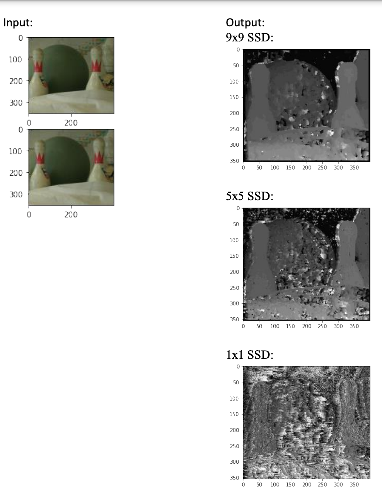
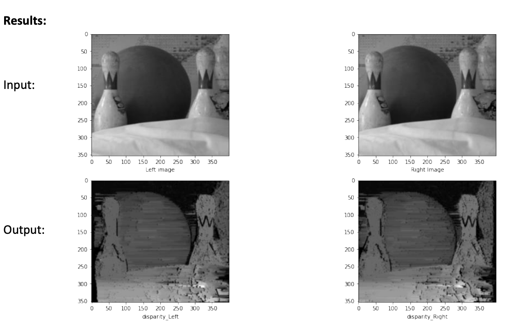

# Stereo-Image-matching
### Overview
Given a left & right images, I applied stereo two stereo matching techniques:
  1.Block matching
  2.Dynamic programming
### Block Matching
In block matching stereo, it is straight forward as both images are already on parallel image planes. All I had to find the match for each pixel along the horizontal epipolar line of the other image. The results were slow and not as good as expected due to inadequate matches, so I had to limit the search range along the epipolar line, making it a lot faster and giving much better depth maps.

Using Both Sum of Absolute Differences and Sum of Squared Differences, I worked on window sizes of 1,5 & 9.
### Results
 
 
 ### Dynamic Programming
In Dynamic programming, I loaded both images, converted them to greyscale and blured them to remove peaks then preformed dynamic programming algorithm. In which I iterate over each row and path over pixel in both scan line and determine whether the pixels match or the left one is occluded or the right one is. The I preform back tracking, using a matrix M that tells in which direction to move, to generate the both disparity maps. 

### Results
 
